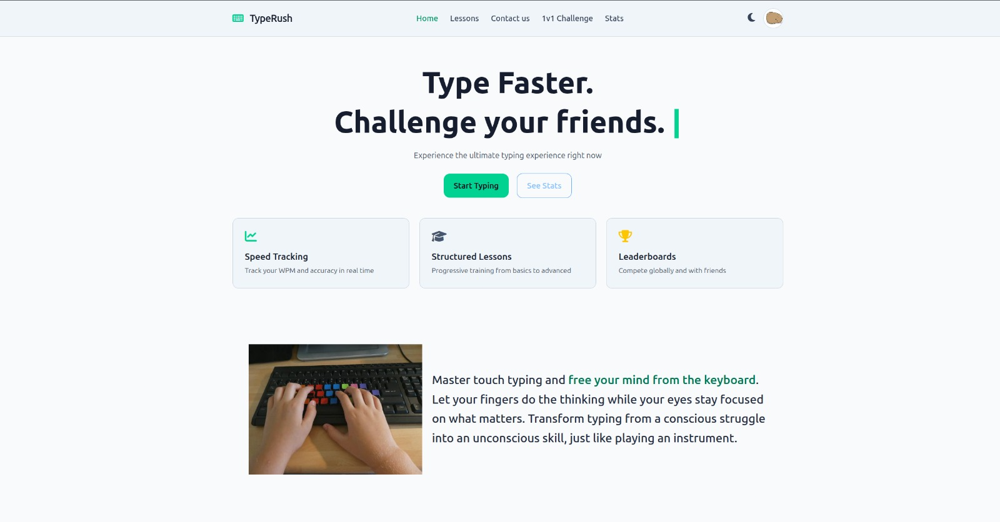
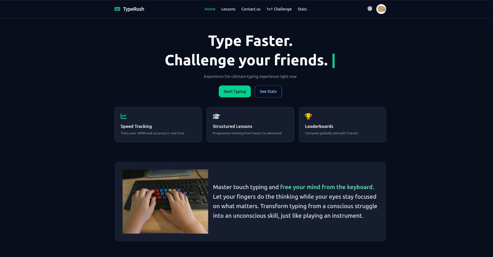
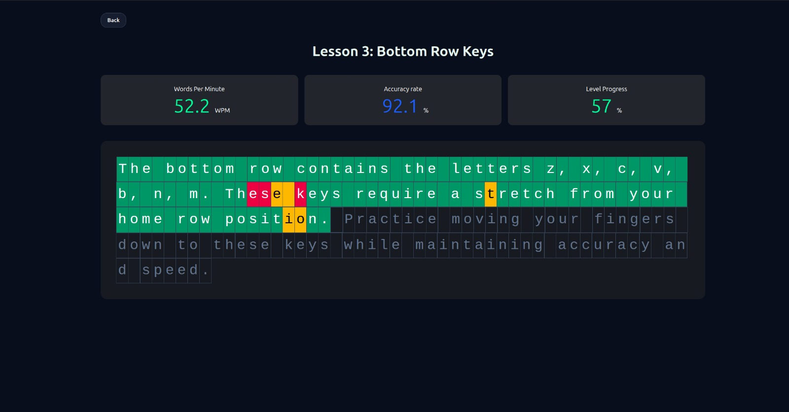
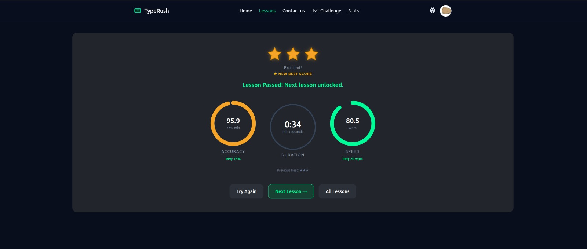
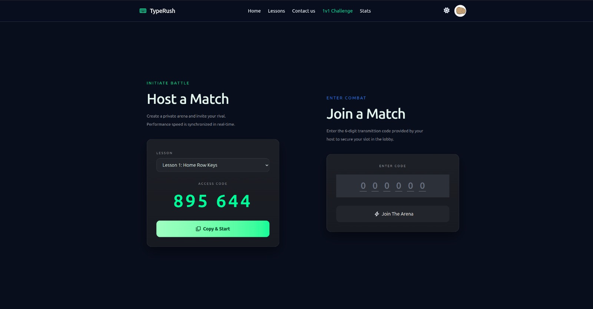
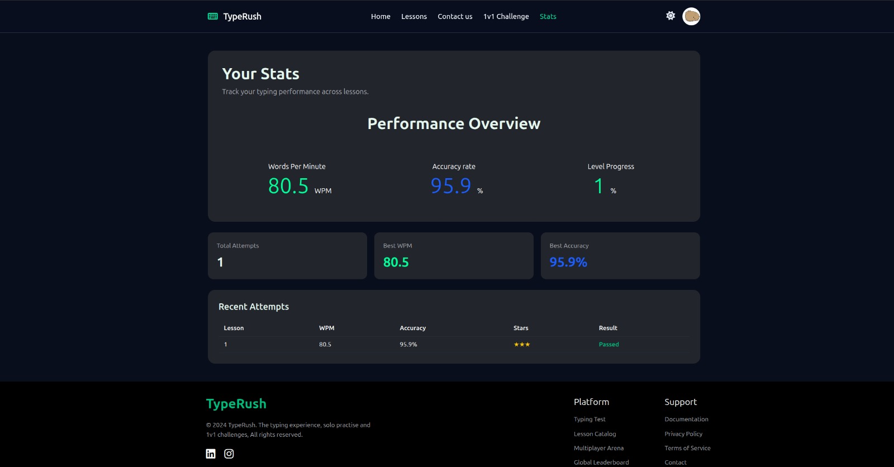
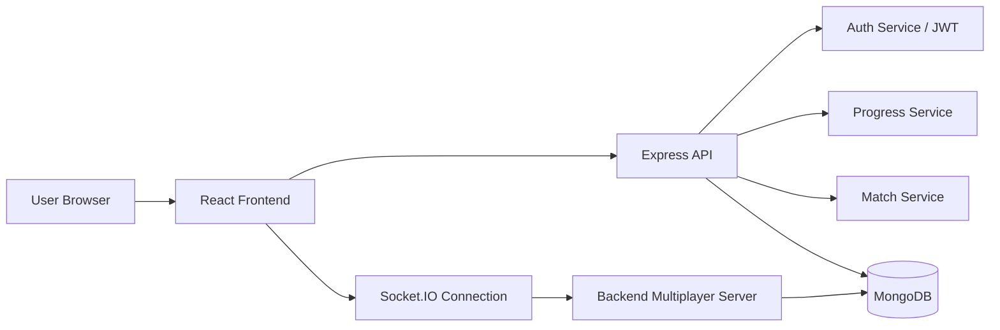

# TypeRush

> TypeRush is a typing-learning and practice platform inspired by TypingClub, with a stronger focus on progression, stats, and live 1v1 typing races.


## Screenshots

These screenshots are the actual project assets currently stored in the repository.

### Landing Page





### Lesson Practice and Results





### Multiplayer and Stats







TypeRush is inspired by TypingClub (A famous touch typing website), but it extends the classic typing practice model with:

- structured lesson progression from beginner to advanced passages
- local and server-backed progress tracking
- WPM / accuracy / completion stats
- dark and light themes
- user authentication and profile setup
- real-time 1v1 multiplayer typing races
- match codes and challenge-based gameplay

## Overview

TypeRush is a full-stack typing game and training app built around short, progressive lessons and competitive practice. The app combines a lesson-driven learning flow with a live multiplayer race mode, giving the project both a solo learning experience and a head-to-head challenge experience.

The current implementation is split cleanly between a React frontend and an Express + MongoDB backend. The frontend handles routing, theme state, lessons, auth state, and gameplay UI, while the backend handles authentication, protected API endpoints, progress persistence, and live socket-based race synchronization.

## Features

### Learning and Practice

- 100 sequential lessons with unlocking based on completion progress
- typing text exercises with WPM, accuracy, and completion tracking
- pass/fail logic based on lesson requirements
- per-lesson star scoring and best result tracking
- results screen for each lesson run
- user-specific progress persistence across sessions

### Authentication and Profiles

- signup and login with email + password
- JWT access token authentication
- refresh-token rotation through HTTP-only cookies
- protected routes for authenticated users
- profile setup after registration
- optional profile image support

### Multiplayer

- host a match with a lesson and generated 6-digit code
- join a match by entering a 6-digit access code
- real-time ready-check and countdown flow
- live typing state synchronization between players
- race completion tracking and final result summary
- match requeue flow for continuing the next lesson

### User Experience

- dark mode and light mode support
- responsive app layout for desktop and smaller screens
- themed UI with a mint-green accent palette
- lesson grids and progression indicators
- stats dashboard for recent attempts and aggregate performance


## Tech Stack

### Frontend

- React 19
- React Router
- Vite
- Tailwind CSS
- Axios
- Socket.IO client
- SweetAlert2
- Font Awesome icons

### Backend

- Node.js
- Express 5
- MongoDB with Mongoose
- JWT (jsonwebtoken)
- bcryptjs
- Zod
- Helmet
- express-rate-limit
- Morgan

### Real-time Communication

- Socket.IO
- backend-managed room/match state for live race events

### Development Tools

- Vite
- ESLint
- Nodemon
- Concurrently

## Architecture



The app is structured as a classic client/server split:

- the frontend is responsible for rendering, client-side state, navigation, and UX
- the backend exposes REST API routes for auth, progress, and match creation/joining
- the database stores users, lesson attempts, and match metadata
- the multiplayer subsystem uses Socket.IO to synchronize live race state between connected players

Important implementation details:

- frontend auth state is tracked by `src/context/AuthContext.jsx` and `src/services/authService.js`
- protected routes are enforced through `ProtectedRoute`
- backend authentication is enforced with `requireAuth` middleware
- lessons are loaded from `src/data/lessons.json`
- the backend delegates major business logic into service modules under `backend/src/modules`

## Project Structure

```text
TypeRush/
├── src/
│   ├── assets/
│   │   ├── images/
│   │   └── Snapshots/
│   ├── components/
│   │   ├── Homepage/
│   │   ├── Lessons/
│   │   ├── Multiplayer/
│   │   ├── Register/
│   │   └── ui/
│   ├── context/
│   ├── data/
│   │   └── lessons.json
│   ├── pages/
│   ├── services/
│   ├── utils/
│   ├── App.jsx
│   ├── index.css
│   ├── main.jsx
│   └── ...
├── backend/
│   ├── src/
│   │   ├── config/
│   │   ├── controllers/
│   │   ├── db/
│   │   ├── middlewares/
│   │   ├── models/
│   │   ├── modules/
│   │   ├── routes/
│   │   ├── sockets/
│   │   ├── utils/
│   │   ├── validators/
│   │   ├── app.js
│   │   └── server.js
│   ├── tests/
│   ├── package.json
│   └── README.md
├── public/
├── package.json
├── vite.config.js
├── index.html
├── eslint.config.js
├── README.md
└── .gitignore
```

### Directory Summary

- `src/components` contains the app’s reusable UI blocks and page sections
- `src/pages` contains route-level pages such as Home, Lessons, Match, Stats, and Register
- `src/context` contains global app state such as theme and auth
- `src/services` contains API and socket interaction logic
- `src/data/lessons.json` contains the lesson library used by the typing trainer
- `backend/src/routes` defines the HTTP API surface
- `backend/src/controllers` keep request handling thin and route-oriented
- `backend/src/modules` contains the business logic for auth, matches, and progress
- `backend/src/sockets/socket.js` contains the live multiplayer socket flow
- `backend/src/models` contains MongoDB models for users, attempts, and matches

## Authentication Architecture

The current authentication flow is straightforward and matches the actual implementation in the codebase:

1. The user signs up at the registration screen.
2. The frontend calls `POST /api/auth/signup` with username, email, and password.
3. The backend creates the user record, hashes the password, and issues an access token.
4. The backend also rotates a refresh token and sends it back as an HTTP-only cookie.
5. The frontend stores the access token in local storage and marks the user as authenticated.
6. Protected routes check the frontend auth state and redirect unauthenticated users.
7. For authenticated API calls, the frontend sends the access token in the `Authorization: Bearer ...` header.
8. The backend enforces this with `requireAuth` middleware before allowing access to protected endpoints.

This app does not include a separate 2FA flow in the current implementation.

## Multiplayer / 1v1 Architecture

The multiplayer experience is one of TypeRush’s defining features.

### Match Creation

A player can create a match from the challenge page. The frontend calls the create-match API and generates a 6-digit code. The code is then copied and shared with another user.

### Match Joining

A second user enters the code and calls `POST /api/matches/join` with the code and username. If the match exists and is still waiting, the user joins the race room.

### Socket Flow

The backend socket layer is responsible for:

- `joinMatch`
- `playerReady`
- `typingStateUpdate`
- `finishRace`
- `requeueMatch`
- `leaveMatch`
- `disconnect`

These events synchronize live typing progress, start countdowns, detect completion, and finalize the winner. Match state is kept in memory for active games and persisted to MongoDB when the race ends.

## Data Flow

### Authentication Flow

```text
Frontend signup/login form
        ↓
POST /api/auth/signup or /api/auth/login
        ↓
Express route → controller → auth service
        ↓
MongoDB user record
        ↓
JWT access token + refresh cookie
        ↓
Frontend stores token and updates auth context
```

### Lesson Flow

```text
User opens lessons page
        ↓
App loads lesson metadata from src/data/lessons.json
        ↓
User completes a practice run
        ↓
Frontend calculates WPM, accuracy, and elapsed time
        ↓
Optional local progress cache updates
        ↓
Server stores attempt when the user is authenticated
```

### Multiplayer Flow

```text
Host creates match code
        ↓
Second user joins using the code
        ↓
Both clients emit playerReady
        ↓
Server starts countdown
        ↓
Race begins and typing updates are exchanged via Socket.IO
        ↓
Both players finish or time out
        ↓
Server calculates result order and emits raceFinished
```

## Getting Started

### Prerequisites

- Node.js 20+
- npm
- MongoDB server or MongoDB Atlas connection

### Installation

```bash
git clone <repository-url>
cd TypeRush
npm install
cd backend
npm install
```

### Environment Variables

The backend validates environment variables centrally in `backend/src/config/env.js`. Create a `.env` file inside the `backend` directory and set the required values:

```env
MONGODB_URI=your_mongodb_connection_string
JWT_ACCESS_SECRET=your_access_token_secret
JWT_REFRESH_SECRET=your_refresh_token_secret
CLIENT_URL=http://localhost:5174
NODE_ENV=development
PORT=5001
```

Do not commit actual secrets or production credentials to the repository.

## Running the Application

### Root project commands

```bash
npm run dev
```

Starts the frontend Vite app.

```bash
npm run dev:backend
```

Starts the backend Express server.

```bash
npm run dev:full
```

Starts both frontend and backend concurrently.

### Backend commands

```bash
cd backend
npm run dev
npm run start
npm run check
npm run lint
```

### Runtime ports

The frontend is configured in `vite.config.js` to use port `5174`.

The backend uses the `PORT` setting from the environment; in the project’s local development flow the frontend is configured to talk to `http://localhost:5001/api` by default in `src/services/authService.js`.

## Usage Guide

### 1. Create an account

Visit the app, create an account, and complete the sign-up form.

### 2. Complete profile setup

After registration, the app directs the user to the profile setup screen so they can optionally add a profile image.

### 3. Start learning

Navigate to the lesson page and begin with the first available lesson. The app tracks progression and unlocks later lessons as the user completes earlier ones.

### 4. Review results

At the end of a lesson, the app shows the result metrics and the next lesson status.

### 5. Review stats

The stats page aggregates the user’s attempt history and displays WPM, accuracy, recent attempts, and totals.

### 6. Host or join a multiplayer race

On the multiplayer screen:

- create a match and get a 6-digit code
- copy the code and share it with another player
- or enter a code to join an existing match

### 7. Race and replay

Once both players are ready, the countdown starts and the typing race begins. When the match ends, the system announces the result and allows requeueing for the next lesson.

## Available Scripts

### Root package scripts

| Script                | Purpose                             |
| --------------------- | ----------------------------------- |
| `npm run dev`         | Start the frontend Vite app         |
| `npm run dev:backend` | Start the backend server            |
| `npm run dev:full`    | Start frontend and backend together |
| `npm run build`       | Build the frontend for production   |
| `npm run lint`        | Run ESLint for the frontend         |
| `npm run preview`     | Preview the production build        |

### Backend package scripts

| Script          | Purpose                              |
| --------------- | ------------------------------------ |
| `npm run dev`   | Start the backend with nodemon       |
| `npm run start` | Start the backend in production mode |
| `npm run lint`  | Run ESLint against backend code      |
| `npm run check` | Syntax-check the backend entrypoint  |

## Design and UI Direction

TypeRush has a dark-mode-first interface with a clean, typing-focused layout. The visual language emphasizes readability, minimal distraction, and rapid feedback during practice and racing sessions. The design uses a mint-green accent system, a contrasting dark background, and responsive cards for lesson and stat summaries.

## Security and Engineering Notes

The current implementation includes several practical safeguards:

- password hashing with `bcryptjs`
- JWT-based authentication using access and refresh tokens
- refresh token storage as a hashed value on the user record
- protected API routes using middleware checks
- request validation using Zod schemas
- API rate limiting for auth endpoints
- CORS restrictions that validate the allowed frontend origin

This is a working application with a production-minded structure, but the repository should still be treated as a project application rather than a hardened system-in-depth platform.

## Contributing

Contributions are welcome for bug fixes, UX improvements, typing content improvements, or backend refactors.

A typical workflow is:

```bash
git checkout -b feature/my-change
# make your changes
npm run lint
cd backend && npm run lint
# test the relevant flow locally
```

Then open a pull request with a clear summary of the change and validation performed.

## Inspiration

TypeRush is inspired by TypingClub, but it is not affiliated with it. The project implements its own lesson progression model, progress tracking, and real-time typing race system to extend the concept beyond a basic typing trainer.

## License

No repository license file was found in the current project tree, so this repository does not currently declare a license.
